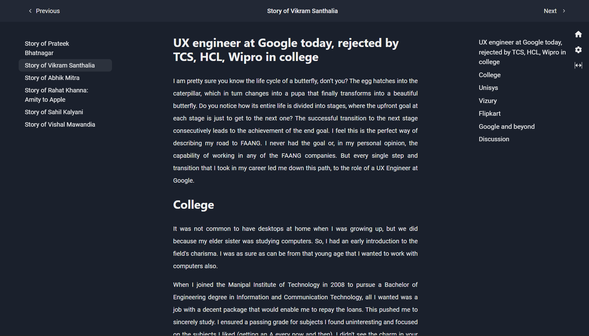
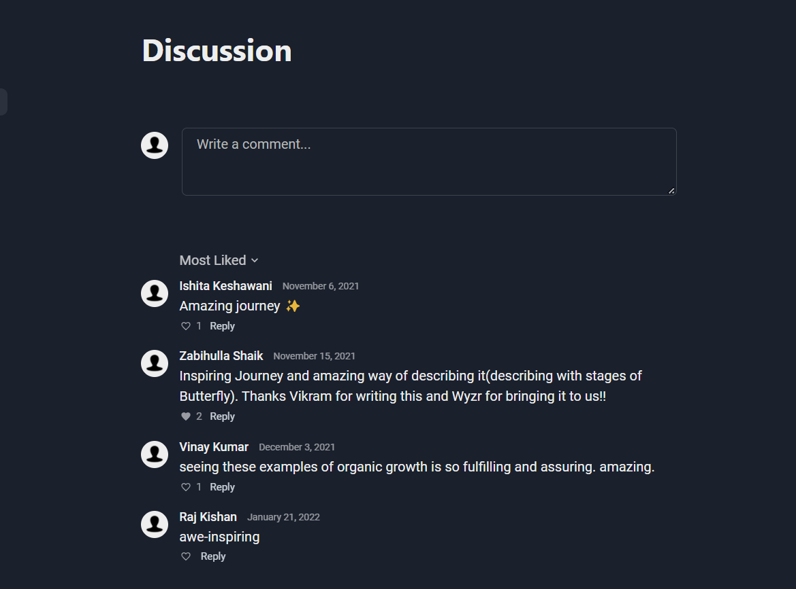

Wyzr is a subscription-based reading service with original content predominantly based on the Indian context. It's been nine months since I first started working on it. I had an internship offer in June. But I wasn't sure whether I wanted to do it because the working hours were more than I could have managed with my academics. That's when I contacted my mentor, Tanay Pratap. He told me about the idea he had been working on and asked me whether I would like to work on it. I love reading, so the product was appealing to me. And the working hours were better suited to my needs.

I started off by working on the reading interface of the application. The tech stack, for now, was Next.js and Chakra UI. One of the main reasons for choosing Next.js was that it supports pre-rendering. In our product, the main content is static, so Static Site Generation (SSG) makes sense for our use case. Next.js also enables us to choose between SSG and SSR on a per-page basis and render some parts entirely on the client-side. Furthermore, Next.js supports Incremental Static Regeneration which will help avoid scalability issues in the future.

Why Chakra UI? It is a highly customizable component library. All the components are accessible and follow the WAI-ARIA standards. It also has built-in support for multiple colour modes, which is an important feature in a reading application.

This is how the reading interface looks as of now.

The pages are generated during build time using markdown files. The table of contents of the book and the chapter are also rendered by parsing the markdown files.

Automatic code splitting and pre-fetching are some other advantages of using Next.js that are worth mentioning.

Another feature that I built was the nested comments system that is visible below every chapter. We decided to use node.js and MongoDB for the backend.

We decided to restrict the nesting to 3 levels to avoid the complexity that needs to be handled with an infinitely nested system like Reddit. The comments can be sorted by

Apart from these two major features, I have also had some minor contributions in the authentication, analytics and payments workflow.

It has been a fun and exciting journey filled with a lot of lessons. Before wyzr, I had never worked on a production app so I learned how to approach an app from a user perspective instead of a learning and experimentation based perspective. I also got a bit of insight into how early-stage startups work.

I would like to end this post by sharing this picture from one of our pizza parties.
