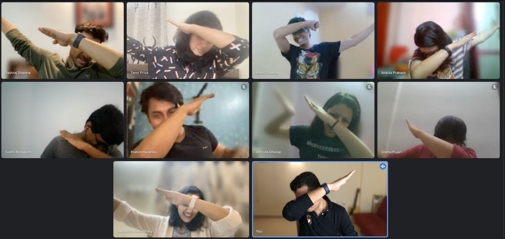

[Wyzr](https://www.wyzr.in/) is a subscription-based reading service with original content predominantly based on the Indian context.

It's been nine months since I first started working on it. I had an internship offer in June. But I wasn't sure whether I wanted to do it because the working hours were more than I could have managed with my academics. That's when I contacted my mentor, [Tanay Pratap](https://twitter.com/tanaypratap) to seek his advice. He told me about the idea he had been working on along with [Yashraj](https://www.linkedin.com/in/yashrajsharma/) and asked me whether I would like to work on it. I love reading, so the product was very appealing to me!

I started off by working on the reading interface of the application. The tech stack, was [Next.js](https://nextjs.org/) and [Chakra UI](https://chakra-ui.com/). One of the main reasons for choosing Next.js was that it supports [pre-rendering](https://nextjs.org/learn/basics/data-fetching/two-forms). In our product, the majority of the content is static, so Static Site Generation (SSG) makes sense for our use case. Next.js also enables us to choose between SSG and SSR on a per-page basis and [render some parts entirely on the client-side](https://nextjs.org/docs/basic-features/data-fetching/client-side). Furthermore, Next.js supports [Incremental Static Regeneration](https://vercel.com/docs/concepts/next.js/incremental-static-regeneration) which will help avoid scalability issues around build time in the future.

Automatic code splitting and pre-fetching are some other advantages of using Next.js that are worth mentioning.

Why Chakra UI? It is a highly customizable component library. All the components are accessible and follow the [WAI-ARIA](https://siteimprove.com/en-us/accessibility/introduction-to-wai-aria/#:~:text=WAI%2DARIA%20refers%20to%20the,accessible%20to%20people%20with%20disabilities.) standards. It also has built-in support for multiple colour modes, which is an important feature in a reading application.

This is how the reading interface looks as of now.

The pages are generated during build time using markdown files. The table of contents of the book and the chapter are also rendered by parsing the markdown files.

This basic reading interface was ready by the end of June. Around this time five more [neoGrads](https://neog.camp/) joined the team. So the tech team went from one to six in less than a week! We had some great discussions and ideation sessions around the product, it was fun!

Another feature that I was responsible for building from end to end was the nested comments system that is visible below every chapter. We decided to use node.js and MongoDB for the backend since all of us were comfortable with it.

We restricted the nesting to 3 levels to avoid the complexity that needs to be handled with an infinitely nested comments system like the one we see on Reddit. The comments can be sorted by newest first, oldest first and most liked.

By August all of the P0 features were implemented and we did a soft launch where we invited the authors to try out the platform and every team member got five invites. After a month or so of bug bash and working on the feedback of early users we publicly launched the product on 20th October.🥳

Apart from these two major features, I have also had some minor contributions in the authentication, analytics and payments workflow.

It has been a fun and exciting journey filled with a lot of lessons. Before wyzr, I had never worked on a production app so I learned how to approach an app from a user perspective instead of a learning and experimentation based perspective. I also got some insight into how early-stage startups work.

Sharing this picture from one of our pizza parties after the product launch.

